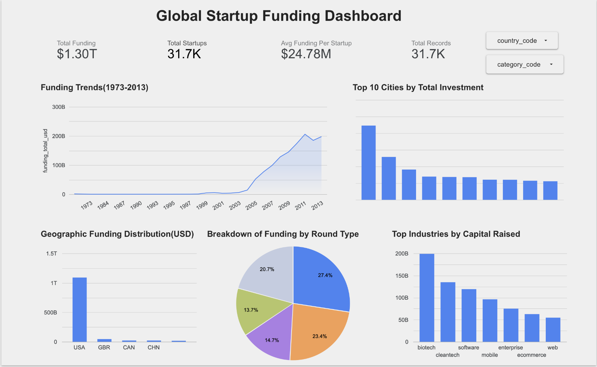

# 🚀 Global Startup Funding Analysis

## 🎯 Overview

This project analyzes global startup funding data to identify **investment trends, high-growth regions, and industry patterns**.

The goal is to transform raw funding data into **actionable business insights** that can support strategic decision-making.

---

## 📊 Dataset

Global startup funding dataset containing:
- Funding amount  
- Year of investment  
- Country and city  
- Industry/sector  

---

## ⚙️ Tools & Technologies

- Python (Pandas, NumPy)  
- SQL  
- Google BigQuery  
- Looker Studio / Tableau  

---

## 🚀 Project Workflow

1. Data Cleaning and Preprocessing  
2. Exploratory Data Analysis (EDA)  
3. Trend and Pattern Analysis  
4. Business Insight Generation  
5. Dashboard Visualization  

---

## 🔍 Key Analysis

- Funding trends over time  
- Country-wise investment distribution  
- Industry-wise funding patterns  
- Identification of high-growth startup ecosystems  

---

## 📈 Key Insights

- Startup funding shows significant growth in recent years  
- A few countries dominate global investment activity  
- Technology sectors receive the majority of funding  
- Investment patterns indicate expansion across global markets  

---

## 🧠 Key Focus

This project emphasizes:
- Identifying **investment patterns in global markets**  
- Translating data into **business insights**  
- Supporting **data-driven strategic decisions**  

---

## 📊 Dashboard

  

---

## 💡 Why This Matters

Understanding funding trends helps:
- Identify emerging markets and industries  
- Support investment and business strategy decisions  
- Analyze global startup ecosystem growth  

---

## 🔮 Future Work

- Build predictive models for funding trends  
- Integrate advanced analytics techniques  
- Enhance dashboard interactivity  

---

## 👩‍💻 Author

**Megha K A**  
Data Analyst | Machine Learning | Python | SQL
